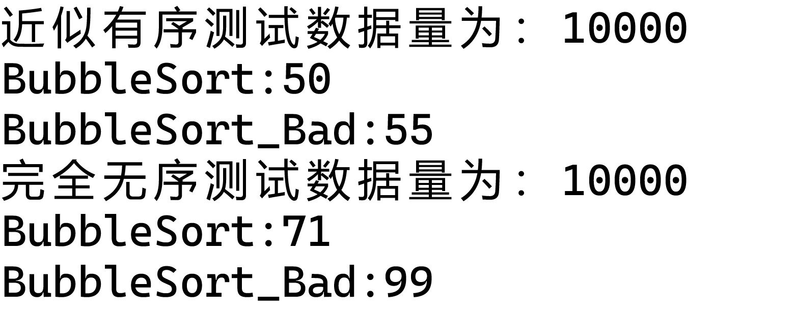
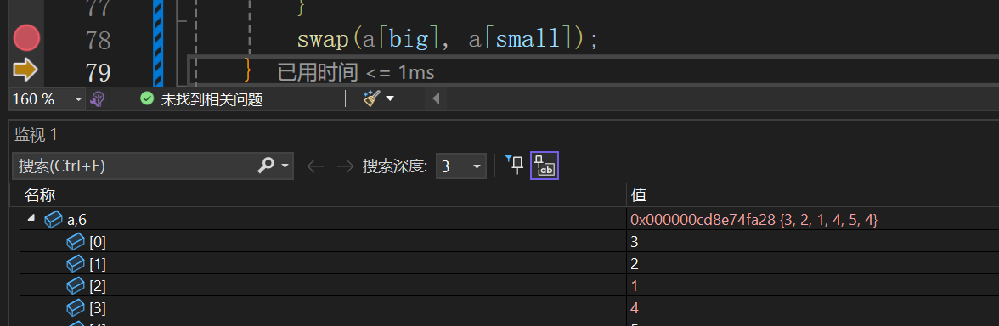
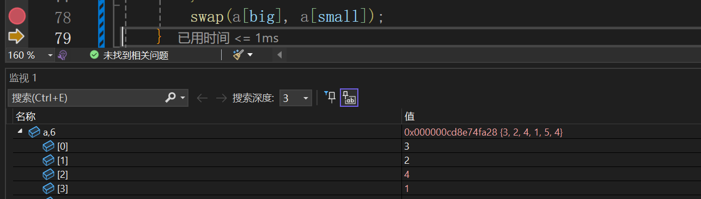
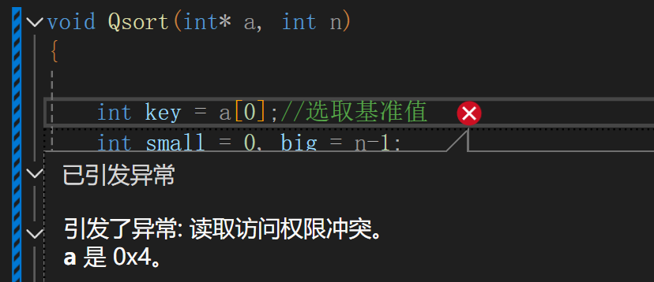
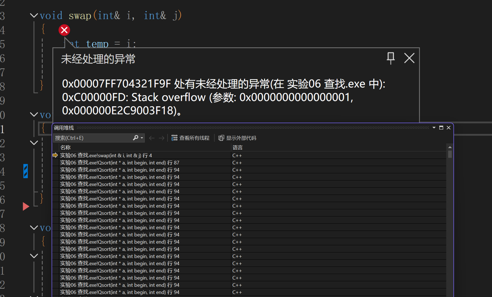
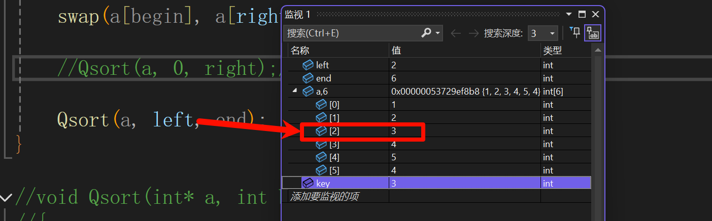
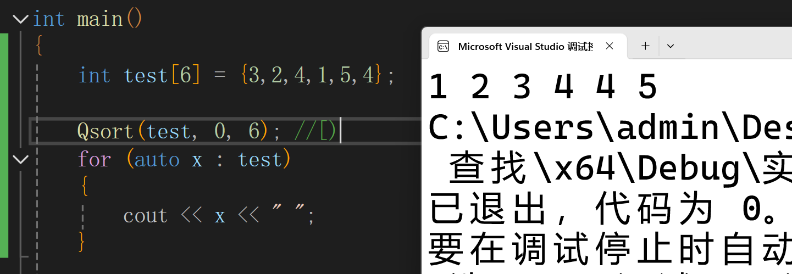
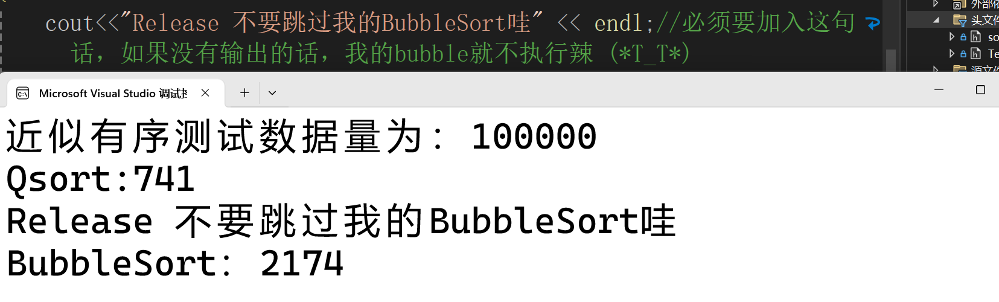
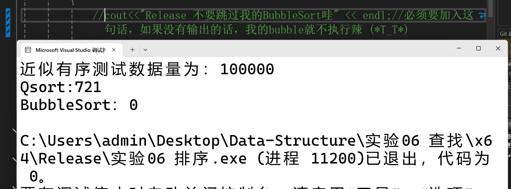

# 开发记录

[toc]

## 目前状态

* [x] 冒泡排序

* [ ] 简单选择排序

* [ ] 快速排序
* [ ] 直接插入排序（链表）
* [ ] 希尔排序
* [ ] 堆排序

## 冒泡排序

代码如下：

```c++
void BubbleSort_Bad(int* a, int n)
{
	for (int j = n - 1; j >= 0; j--)
	{
		for (int i = 0; i < j; i++)
		{
			if (a[i] > a[i + 1])
			{
				swap(a[i], a[i + 1]);
			}
		}
	}
}
```

出现的问题：会写单趟排序，但是把一趟改成多趟的时候会出现一些奇怪的问题

改进小措施，在我写检验校验数组的排序结果部分的时候，我想到了如果加一个`flag`来表示我的数组是否已经有序了，如果有序的话那么`flag`就会等于`1`，然后检测一下`flag `的结果来判断时候已经有序，经过测试还是**非常有用**的！！

改进之后的代码：

```c++
void BubbleSort(int* a, int n)
{
	for (int j = n - 1; j >= 0; j--)
	{
		int flag = 0;//增加flag
		for (int i = 0; i < j; i++)
		{
			if (a[i] >a[i + 1])
				swap(a[i], a[i + 1]);
			flag = 1;
		}
		if (flag == 0)
		{
			break;
		}
	}
}
```

实战测试：测试条件Release版本 X86




## 快速排序

### 霍尔排序

#### debug 1

```C++
while (small <big)
{
	for (; a[small] <= key; small++)//a[small]>=key
	{
	}
	for (; a[big] >= key; big--)//a[big]<=key
	{
	}
	swap(a[big], a[small]);
}
```

这是一个在快速排序时为了找到`key`的一串代码，有一个很经典的错误：





在交换`a[big]`, `a[small]`的时候，每次交换都会交换两次，导致原本交换之后又被交换回去出现bug，解决方案就是加人两行`big--;` ` small++;`

#### debug2

```c++
void Qsort(int* a, int n)
{

	int key = a[0];//选取基准值
	int small = 0, big = n-1;
	while (small <big)
	{
		for (; a[small] <= key; small++)//a[small]>=key
		{
		}
		for (; a[big] >= key; big--)//a[big]<=key
		{
		}
		if (small < big)
		{
			swap(a[big], a[small]);
			big--;
			small++;
		}
		
	}
	swap(a[0],  a[big]);
	Qsort(a, big );
	Qsort((int*)a[big+1], n);
}
```
==bug太多了==，而且遇到一个不好解决的问题：函数`Qsort`的传参有问题，当我在`key`两端分别去递归执行Qsort时，在第二部分是不好传参的

* 不能直接传`a[big]`，因为类型不匹配，传参要求的类型是`int *`，但是`a[big]`的类型是`int`

* 终止条件不太好判断，理论上也能判断就是地址的相减

* 不能强制类型转换`(int*)a[big+1]`，得到的是地址，会出现地址访问错误如下：

  

* 其他类型的`bug`，例如无法在循环结束的时候保证`small`<`big`，导致最终插入的时候出现问题`swap(a[0],  a[big]);`问题太多了不改了直接换一种传参方式

#### debug 3 大的 bug修正

~~每个bug写一个bug修复有点麻烦~~，修正了很多bug，说大不大，说小不小，一起放到这里了

```c++
void Qsort(int* a, int begin, int end)
{
	if (begin == end)
	{
		return;
	}
	int left = begin, right = end-1;


	int key = a[left];// 选取关键值
	while (left < right)
	{
		while (left < right && a[left] < key)
		{
			left++;
		}
		while (left < right && a[right] >key)
		{
			right--;
		}
		swap(a[left], a[right]);
	}

	// 
	Qsort(a, 0, right);
	Qsort(a, left, end);
}
```

1. 我的递归爆炸了！！！！！！==Stack overflow 表示栈溢出！！！！！==说明我的递归调用调用了很多次，但是我的测试用例一共才6个数字，一看就是死循环了

   

   

   原因分析：在第26行的`Qsort(a, left, end);`中，我的第二个参数没有传输正确，这个递归应该从`3-5`开始因为`2`的位置已经确定了！！！！！，就不要再排了(╥╯^╰╥)！！！！！！

   包括`Qsort(a, 0, right)`也是，但是我的测试用例没有测试出来，是在跑测试的时候`CheckSort`测出来的，每次排序不一定都是从0的位置开始的

2. 我的判断条件也不对

   判断条件不能包含等于，如果等于的话就会导致在key所在的正确位置旁边都会有等于`key`的值，虽然理论上没啥问题，但是当`key==3`时就会出现`1,3,2,3,4,5`从而导致bug！！

3. `if (begin == end)`，虽然理是这个理，当两端重复的时候就不用排了，但是吧，很多情况下`end`都是小于`begin`的导致出现问题

4. 有一个重要的一点就是一定要先找右边的部分，然后再找左边的部分

5. 修改后代码如下：

```c++
void Qsort(int* a, int begin, int end)
{
	//停止条件
	if (begin >= end - 1) 
	{
		return;
	}
	int left = begin, right = end - 1;

	int key = a[left];
	while (left < right)
	{
		//右边找小，不是的话移动,是的话不移动，并且跳出循环
		while (left < right && a[right] >= key)
		{
			right--;
		}
		//左边找大，不是的话移动，是的话不移动，并且跳出循环
		while (left < right && a[left] <= key)
		{
			left++;
		}

		swap(a[left], a[right]);
	}

	swap(a[begin], a[right]);
	//递归调用部分
	Qsort(a, begin, right);
	Qsort(a, right + 1, end);
}
```


==改完之后老正确了！！！！==



#### 时间性能测试



不加的话是真的跳过哇，o(╥﹏╥)o，**找半天找不到为啥跳过了**，大概的原因就是因为两个数组都是完全一样的，而且`BubbleSort`函数中，如果没有产生如输出到控制台、修改全局变量、进行文件操作等外部可见的操作，所以就会被优化掉

****

## 其他的小组件

### 基于范围的for循环

在C++11中，增加了一个特性叫做基于范围的for循环，可以~~好玩的~~去打印数组

原始打印如下：

```c++
for (int i = 0; i < sizeof(arr) / sizeof(int); ++i)
	cout << arr[i] << " ";
```

但是基于范围的for循环就很好玩,也很简单

```c++
for (auto x : test)
	{
		cout << x << " ";
	}
```

### 校验数组的排序结果

```c++
void CheckSort(int* a, int n)
{
	for (int i = 0; i < n-1; i++)
	{
		// (a[i] >= a[i + 1]) 这里不能用>= ，更正如下：
		assert(a[i] <= a[i + 1]);
		}
	}
}
```

### 创建一个近似有序的数组

以`冒泡排序`为例：

```c++
void generate_nearly_sorted_array(int arr[], int size, double disorder_factor) {
	// 初始化数组为完全有序
	for (int i = 0; i < size; ++i) {
		arr[i] = i;
	}

	// 计算需要交换的次数
	int num_swaps = (int)(size * disorder_factor);

	// 随机交换元素
	for (int i = 0; i < num_swaps; ++i) {
		int idx1 = rand() % size;
		int idx2 = rand() % size;

		// 交换元素
		int temp = arr[idx1];
		arr[idx1] = arr[idx2];
		arr[idx2] = temp;
	}
}

void copy_array(int source[], int destination[], int size) {
	for (int i = 0; i < size; ++i) {
		destination[i] = source[i];
	}
}

void Testorder()
{
	double disorder_factor = 0.2;  // 数组的无序程度（20%的元素可能被打乱）

	// 创建一个数组
	int arr[SIZE];

	// 初始化随机数种子
	srand(time(NULL));

	// 生成近似有序的数组
	generate_nearly_sorted_array(arr, SIZE, disorder_factor);

	int arr2[SIZE];
	copy_array(arr, arr2, SIZE );

	cout << "近似有序测试数据量为：" << SIZE << endl;

	int begin1 = clock();
	BubbleSort(arr, SIZE);
	int end1 = clock();
	CheckSort(arr, SIZE);
	cout << "BubbleSort:" << end1 - begin1 << endl;


	int begin2 = clock();
	BubbleSort_Bad(arr2, SIZE);
	int end2 = clock();
	CheckSort(arr2, SIZE);
	
	cout << "BubbleSort_Bad:" << end2 - begin2 << endl;


}
```

`copy_array`是复制一个数组，为了控制变量

`generate_nearly_sorted_array`是为了创建一个近似有序的数组，方便测试性能

不是很重要就不详细讲了。

