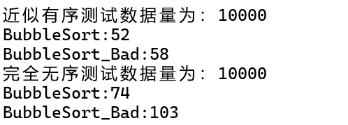

# 开发记录

* [x] 冒泡排序

* [ ] 简单选择排序

* [ ] 快速排序
* [ ] 直接插入排序（链表）
* [ ] 希尔排序
* [ ] 堆排序

## 冒泡排序

代码如下：

```c++
void BubbleSort_Bad(int* a, int n)
{
	for (int j = n - 1; j >= 0; j--)
	{
		for (int i = 0; i < j; i++)
		{
			if (a[i] > a[i + 1])
			{
				swap(a[i], a[i + 1]);
			}
		}
	}
}
```


出现的问题：会写单趟排序，但是把一趟改成多趟的时候会出现一些奇怪的问题

改进小措施，在我写检验校验数组的排序结果部分的时候，我想到了如果加一个`flag`来表示我的数组是否已经有序了，如果有序的话那么`flag`就会等于`1`，然后检测一下`flag `的结果来判断时候已经有序，经过测试还是**非常有用**的！！

改进之后的代码：

```c++
void BubbleSort(int* a, int n)
{
	for (int j = n - 1; j >= 0; j--)
	{
		int flag = 0;//增加flag
		for (int i = 0; i < j; i++)
		{
			if (a[i] >a[i + 1])
				swap(a[i], a[i + 1]);
			flag = 1;
		}
		if (flag == 0)
		{
			break;
		}
	}
}
```

****

## 其他的小组件

### 基于范围的for循环

在C++11中，增加了一个特性叫做基于范围的for循环，可以~~好玩的~~去打印数组

原始打印如下：

```c++
for (int i = 0; i < sizeof(arr) / sizeof(int); ++i)
	cout << arr[i] << " ";
```

但是基于范围的for循环就很好玩,也很简单

```c++
for (auto x : arr)
	{
		cout << x << " ";
	}
```

### 校验数组的排序结果

```c++
void CheckSort(int* a, int n)
{
	for (int i = 0; i < n-1; i++)
	{
		//if (a[i] >= a[i + 1]) 这里不能用>= ，更正如下：
        if (a[i] > a[i + 1])
		{
			cout << "排序未完成" << endl;
		}
	}
}
```

## 创建一个近似有序的数组

以`冒泡排序`为例：

```c++
void generate_nearly_sorted_array(int arr[], int size, double disorder_factor) {
	// 初始化数组为完全有序
	for (int i = 0; i < size; ++i) {
		arr[i] = i;
	}

	// 计算需要交换的次数
	int num_swaps = (int)(size * disorder_factor);

	// 随机交换元素
	for (int i = 0; i < num_swaps; ++i) {
		int idx1 = rand() % size;
		int idx2 = rand() % size;

		// 交换元素
		int temp = arr[idx1];
		arr[idx1] = arr[idx2];
		arr[idx2] = temp;
	}
}

void copy_array(int source[], int destination[], int size) {
	for (int i = 0; i < size; ++i) {
		destination[i] = source[i];
	}
}

void Testorder()
{
	double disorder_factor = 0.2;  // 数组的无序程度（20%的元素可能被打乱）

	// 创建一个数组
	int arr[SIZE];

	// 初始化随机数种子
	srand(time(NULL));

	// 生成近似有序的数组
	generate_nearly_sorted_array(arr, SIZE, disorder_factor);

	int arr2[SIZE];
	copy_array(arr, arr2, SIZE );

	cout << "近似有序测试数据量为：" << SIZE << endl;

	int begin1 = clock();
	BubbleSort(arr, SIZE);
	int end1 = clock();
	CheckSort(arr, SIZE);
	cout << "BubbleSort:" << end1 - begin1 << endl;


	int begin2 = clock();
	BubbleSort_Bad(arr2, SIZE);
	int end2 = clock();
	CheckSort(arr2, SIZE);
	
	cout << "BubbleSort_Bad:" << end2 - begin2 << endl;


}
```

`copy_array`是复制一个数组，为了控制变量

`generate_nearly_sorted_array`是为了创建一个近似有序的数组，方便测试性能

不是很重要就不详细讲了。

